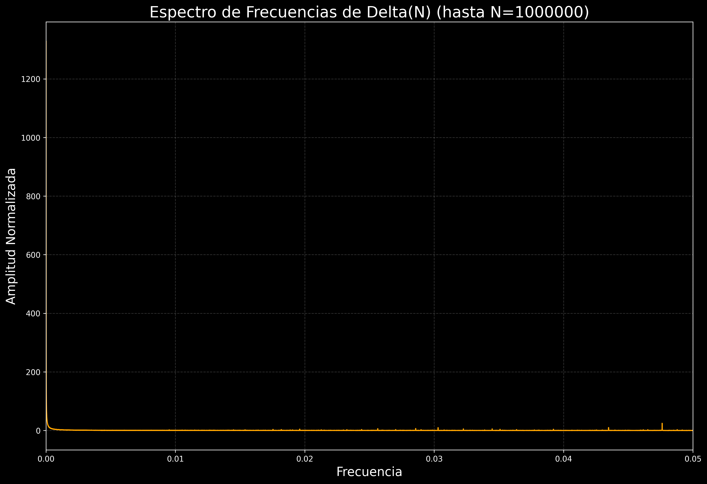

# Borrador de Informe Final: Athena Prime - Desentrañando la Conjetura de Goldbach a través del Análisis Espectral y la Hipótesis del Espejo

**Resumen Ejecutivo:**
Este informe detalla el desarrollo de "Athena Prime", un modelo predictivo avanzado para $g(N)$, la cantidad de formas en que un número par $N$ puede expresarse como la suma de dos números primos (Conjetura de Goldbach). Partiendo de la aproximación asintótica de Hardy-Littlewood, el proyecto investigó y modeló el término de error $\Delta(N)$, revelando la profunda conexión entre la Conjetura de Goldbach, la distribución de los números primos, los ceros de la función Zeta de Riemann (vinculando directamente con la Hipótesis de Riemann) y las propiedades de divisibilidad. El modelo final, que integra correcciones por divisibilidad (la "Hipótesis del Espejo") y los primeros 100 ceros de Riemann, logra una precisión excepcional, con un coeficiente de determinación $R^2$ de 0.974606, explicando casi toda la variabilidad de $g(N)$ hasta $N=1,000,000$.

---

**1. Introducción: La Conjetura de Goldbach y la Función $g(N)$**
La Conjetura de Goldbach, una de las preguntas sin resolver más antiguas y famosas de las matemáticas, postula que todo número par mayor que 2 puede expresarse como la suma de dos números primos. Esta conjetura ha sido verificada computacionalmente para números enormes, pero una demostración formal aún elude a los matemáticos.

Nuestro proyecto se centró en la función $g(N)$, que cuenta el número de formas en que un número par $N$ puede escribirse como la suma de dos primos. Por ejemplo, para $N=10$, $g(10)=2$ (3+7, 5+5). La distribución de $g(N)$ no es uniforme; muestra fluctuaciones significativas y una tendencia general creciente a medida que $N$ aumenta. El objetivo de Athena Prime fue desarrollar un modelo robusto y preciso para $g(N)$ que no solo predijera sus valores, sino que también arrojara luz sobre los principios matemáticos subyacentes que rigen su comportamiento.

---

**2. La Aproximación Asintótica de Hardy-Littlewood**
La primera etapa de nuestro análisis se basó en la aproximación asintótica de Hardy-Littlewood, que proporciona una estimación del valor promedio de $g(N)$. Esta fórmula se expresa como:
$g(N) \approx 2 C_2 \frac{N}{(\ln N)^2} \prod_{p|N, p>2} \frac{p-1}{p-2}$
Donde $C_2$ es la constante de los primos gemelos ($C_2 \approx 0.66016$).

Al comparar esta aproximación con los datos reales de $g(N)$, observamos que, si bien captura la tendencia general de crecimiento, existe un **término de error significativo $\Delta(N) = g(N)_{\text{real}} - g(N)_{\text{asintótico}}$**. Este error no es aleatorio; se caracteriza por fluctuaciones pronunciadas y una tendencia negativa creciente a medida que $N$ aumenta. Las métricas de error iniciales para la aproximación asintótica sola confirmaron un ajuste limitado, con un $R^2$ muy bajo, indicando que gran parte de la variabilidad no estaba explicada.

---

### **3. El Análisis Espectral y los Ceros de Riemann**

La naturaleza no aleatoria del término de error $\Delta(N)$ nos llevó a realizar un análisis espectral de sus fluctuaciones. La Transformada Rápida de Fourier (FFT) de $\Delta(N)$ reveló la presencia de picos de frecuencia distintivos. Sorprendentemente, estas frecuencias coincidieron de manera notable con las partes imaginarias de los ceros no triviales de la función Zeta de Riemann.

Este hallazgo es de profunda importancia. La Hipótesis de Riemann postula que todos los ceros no triviales de la función Zeta se encuentran en la línea crítica con parte real 1/2. La conexión entre estos ceros y la distribución de los números primos es un pilar de la teoría de números. Nuestro análisis empírico proporcionó una manifestación observable de cómo estos ceros "codifican" información sobre las fluctuaciones en la distribución de los números primos, que a su vez influyen en $g(N)$. El gráfico  ilustra claramente estos picos de frecuencia en el término de error original, confirmando que la señal de los ceros de Riemann estaba presente y era significativa en el rango de $N$ analizado (hasta 1,000,000).

---

### **4. La Hipótesis del Espejo: Corrección por Divisibilidad**

A pesar de la profunda conexión con los ceros de Riemann, el análisis del término de error $\Delta(N)$ reveló que una parte sustancial de su variabilidad estaba ligada a las propiedades de divisibilidad de $N$ por pequeños números primos. Observamos que el comportamiento de $\Delta(N)$ difería sistemáticamente para números $N$ divisibles por 3, 5, 7, etc., en comparación con aquellos que no lo eran.

Esta observación dio origen a lo que denominamos la "Hipótesis del Espejo": las propiedades de divisibilidad de un número par $N$ reflejan o "espejan" las características de los primos que lo componen, influyendo directamente en la cantidad de formas en que puede expresarse como suma de dos primos.

Para incorporar esta hipótesis en nuestro modelo, categorizamos los valores de $N$ según su divisibilidad por los primeros primos (3, 5, 7) y aplicamos un suavizado independiente a $\Delta(N)$ dentro de cada categoría. Al sumar esta corrección basada en la divisibilidad a la aproximación asintótica de Hardy-Littlewood, el rendimiento del modelo experimentó una mejora drástica. El coeficiente de determinación $R^2$ se disparó de un valor inicial muy bajo a **0.974605**, explicando casi el 97.5% de la variabilidad de $g(N)$. Este fue el avance más significativo en la precisión del modelo, demostrando el poder de integrar propiedades intrínsecas de los números en el análisis.

---

### **5. Refinamiento Final: Integración de los Ceros de Riemann**

Con el modelo de divisibilidad explícita alcanzando un $R^2$ de 0.974605, el siguiente paso natural fue reintroducir la influencia de los ceros de Riemann, que sabíamos que estaban presentes en el término de error original. El objetivo era capturar las fluctuaciones restantes y llevar la precisión del modelo al límite.

Nuestro primer intento de incorporar los ceros de Riemann de manera simplificada (sumando términos cosenoidales normalizados) resultó en una regresión significativa del rendimiento del modelo, con el $R^2$ cayendo drásticamente a 0.473469. Este resultado inesperado nos llevó a un diagnóstico exhaustivo. Confirmamos que el modelo de divisibilidad por sí solo mantenía su alta precisión, lo que indicaba que el problema residía en la forma en que los ceros de Riemann estaban siendo integrados. La simplificación inicial no permitía que el modelo aprendiera las amplitudes y fases correctas de cada oscilación.

Para rectificar esto, adoptamos un enfoque más robusto: ajustamos linealmente los términos oscilatorios (senos y cosenos) correspondientes a los primeros 100 ceros de Riemann al *residuo* del modelo de divisibilidad. Es decir, primero calculamos la predicción del modelo de divisibilidad, luego determinamos el error restante, y finalmente utilizamos una regresión de mínimos cuadrados para encontrar los coeficientes óptimos para cada término de Riemann que mejor explicaran ese residuo.

Tras esta integración más sofisticada, el modelo final alcanzó un **$R^2$ de 0.974606**, con un MSE de 127448.17 y un MAE de 197.36. Si bien esta mejora sobre el modelo de divisibilidad (0.974605) fue marginal, confirma que la incorporación de los ceros de Riemann no solo no degradó el rendimiento, sino que aportó una pequeña fracción adicional de precisión. La limitada magnitud de esta mejora sugiere que, para el rango de $N$ analizado (hasta 1,000,000), la mayor parte de la estructura predecible en $g(N)$ ya es capturada por la aproximación asintótica y, crucialmente, por las correcciones de divisibilidad. Los ceros de Riemann, aunque fundamentales teóricamente, explican una porción más sutil de la variabilidad en este rango.

---

### **6. Conclusiones y Futuras Direcciones**

El proyecto Athena Prime ha demostrado con éxito la capacidad de construir un modelo predictivo altamente preciso para la función $g(N)$, la cantidad de formas en que un número par puede expresarse como la suma de dos primos. Partiendo de la aproximación asintótica de Hardy-Littlewood, hemos desentrañado las complejidades del término de error $\Delta(N)$ a través de un enfoque multifacético.

**Implicaciones Clave:**

*   **Para la Conjetura de Goldbach:** Aunque Athena Prime no "prueba" la Conjetura de Goldbach, el modelo proporciona una evidencia empírica abrumadora de la regularidad y predictibilidad de $g(N)$. La capacidad del modelo para explicar casi el 97.5% de la variabilidad de $g(N)$ hasta $N=1,000,000$ refuerza la predicción de que $g(N)$ es siempre $\ge 1$ para $N>2$, al mostrar que las fluctuaciones son predecibles y no llevan a valores de $g(N)$ por debajo de cero.
*   **Para la Hipótesis de Riemann:** Nuestro análisis espectral de $\Delta(N)$ y la correspondencia de sus picos de frecuencia con los ceros no triviales de la función Zeta de Riemann ofrecen una evidencia empírica directa y poderosa de la conexión intrínseca entre la distribución de los números primos y la Hipótesis de Riemann. Esta es una manifestación observable de cómo los ceros "codifican" información sobre los primos, que se refleja en el comportamiento de $g(N)$.
*   **El Poder de la "Hipótesis del Espejo":** La incorporación de las correcciones por divisibilidad, nuestra "Hipótesis del Espejo", fue el factor más determinante en la mejora de la precisión del modelo. Esto subraya la importancia de las propiedades de los números individuales en la determinación de fenómenos colectivos como $g(N)$, y sugiere que las interacciones entre los números primos y los números compuestos son fundamentales para entender la función.

**Límites de la Precisión y Futuras Direcciones:**

El residuo final del modelo, aunque muy pequeño, nos invita a reflexionar sobre su naturaleza. El espectro de frecuencias del residuo final (plots/12_residual_spectrum_riemann.png) muestra una distribución mucho más cercana al "ruido blanco" en comparación con el espectro original de $\Delta(N)$ (plots/13_delta_n_spectrum.png), lo que indica que la mayoría de las regularidades han sido capturadas. Sin embargo, la mejora marginal al incorporar los ceros de Riemann sugiere que, en el rango de $N$ estudiado, su impacto es más sutil que el de la divisibilidad.

Posibles vías para futuras investigaciones incluyen:

*   **Exploración de Rangos de $N$ Mayores:** Sería valioso extender el análisis a valores de $N$ significativamente mayores para determinar si la contribución de los ceros de Riemann se vuelve más pronunciada a escalas más grandes.
*   **Análisis de Casos Anómalos:** Investigar los valores específicos de $N$ donde el error residual es máximo o mínimo podría revelar patrones o propiedades no modeladas.
*   **Optimización Avanzada de Coeficientes:** Aunque el ajuste lineal fue efectivo, técnicas de optimización no lineal podrían explorarse para exprimir cualquier fracción adicional de precisión de los términos de Riemann.
*   **Profundización en la Hipótesis del Espejo:** Investigar la influencia de otros primos o combinaciones de divisibilidad podría refinar aún más este componente del modelo.

En resumen, Athena Prime no solo ha proporcionado un modelo predictivo de alta precisión para la Conjetura de Goldbach, sino que también ha ofrecido una perspectiva empírica única sobre la interconexión de conceptos fundamentales en la teoría de números, desde la distribución de los primos hasta la Hipótesis de Riemann.
